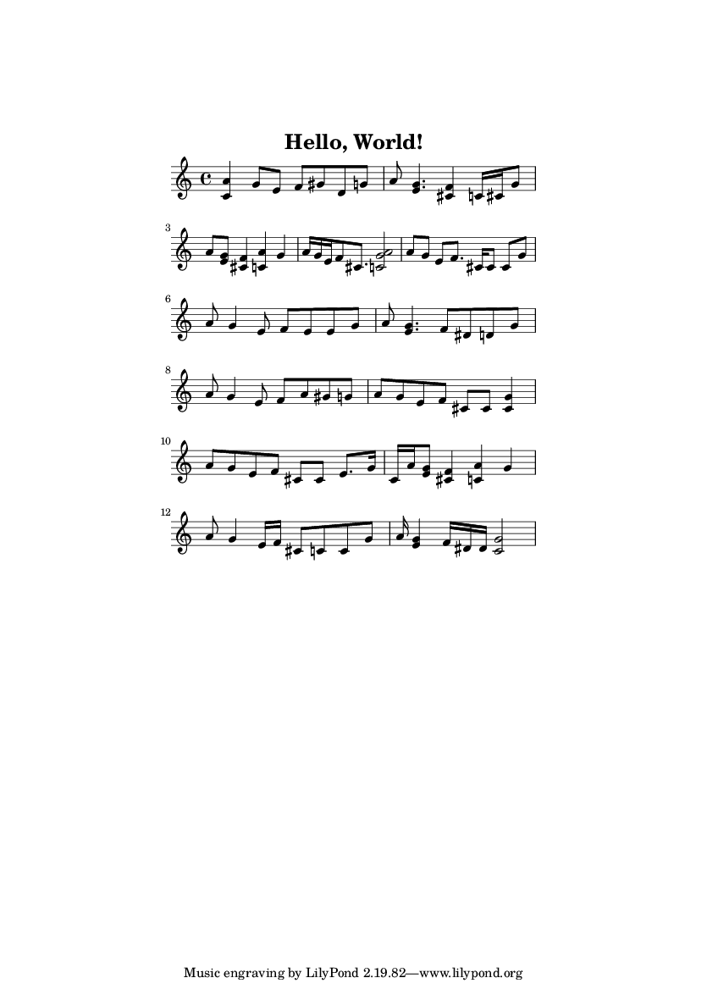

# Hello World in Velato

[Velato] is a music-based programming language that accepts a MIDI file as
input. This is my hello world.

[Velato]: http://velato.net/

## Dependencies

### Velato compiler

The [compiler] is written in C# and I couldn't find a recent pre-compiled
binary, so I needed a way to compile it myself. I developed this on macOS, so I
used Mono from Homebrew:

[compiler]: https://github.com/rottytooth/Velato

```
brew install mono
```

Mono ships with the `msbuild` program, which we can use to compile the Velato
compiler:

```
msbuild Rottytooth.Esolang.Velato/Rottytooth.Esolang.Velato.csproj /p:Configuration=Release
```

This will put the compiled output in the `Rottytooth.Esolang.Velato/bin/Release`
directory. The `Velato.exe` and `NAudio.dll` files are what we're interested in.
They have been copied into the `vendor` directory of this repo for convenience.

### LilyPond

Since Velato takes MIDI as its input, I needed a way to produce a MIDI file.
[LilyPond] is a "music engraving program" whose focus is producing high quality
sheet music, but will also output MIDI.

Note: I used LilyPond version 2.19.x for this, which is currently pre-release.
There is a Homebrew package, via casks, that is 2.18.x, which doesn't produce a
midi that Velato accepts.

[LilyPond]: http://lilypond.org/

## Building & executing

The general flow is:

1. `lilypond hello-world.ly`
1. `mono vendor/Velato.exe hello-world.midi`
1. `mono hello-world.mid.exe`

The included `build` script is a convenience for steps 1 & 2.


